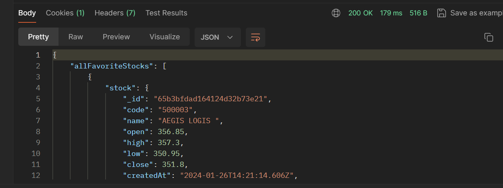
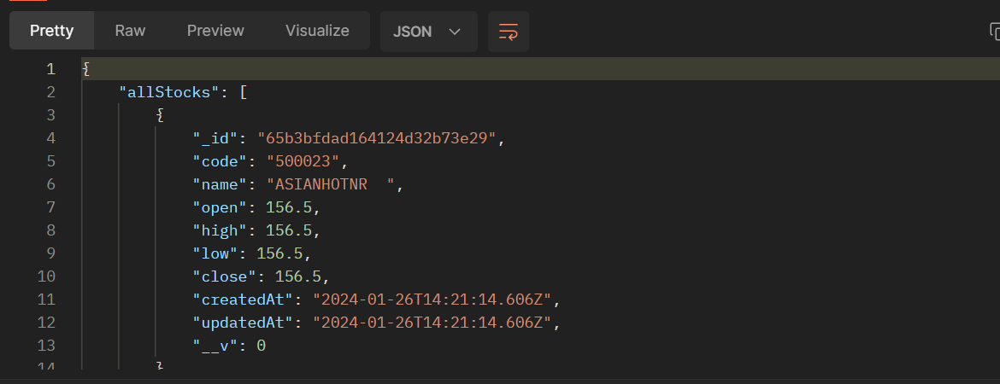

# Hypergo.io Backend intern assignment

## Table of Contents

- [Installation](#installation)

## Installation

```bash
npm install
npm start

// set up for reddis
install docker 
docker pull redis/redis-stack
docker run -d --name redis-stack -p 6379:6379 -p 8001:8001 redis/redis-stack:latest
```
#### How to use Api's
-[ Reegister User](#register-user-create-user)
-[ Add Favourite stock](#add-favourite-stock)
-[ All Favourite stock](#get-all-favourite-stock)
-[ Delete Favourite stock](#delete-favourite-stock)
-[ Find stock by name](#find-stock-by-name)
-[ Top 10 stocks](#find-top-10-stocks)
-[ UI of Stocks](#ui-plot-for-the-stocks)

#### Register user (create user)
 /register 
provide username and password in body


output:


##### Add favourite stock
 /addFavorite
provide userId and stockId in body


output:


#### Get All favourite stock
 /allFavorite
provide userId in body


output:


#### Delete favourite stock
/deleteFavorite
provide UserId and stock id in body 


output:


#### Find Stock by Name
/sotckByName
Provide stock_name in query paramter


Ouput:


#### Find Top 10 stocks
/top10stocks
Provide the parameter 


output :



#### Ui plot for the Stocks
I did able to store multiple days stock so ,I am not able to make a route to send json data from handling graph of stocks with respect to time


#### Implemented caching using redis
#### hosted the backend in render.com https://niteshkumar11.onrender.com


